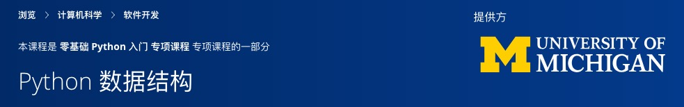

## Python Data Structures
> **初级**

### [关于此课程](https://www.coursera.org/learn/python-data?specialization=python)
This course will introduce the core data structures of the Python programming language. We will move past the basics of procedural programming and explore how we can use the Python built-in data structures such as lists, dictionaries, and tuples to perform increasingly complex data analysis. This course will cover Chapters 6-10 of the textbook “Python for Everybody”.  This course covers Python 3.

#### [第 6 章: 字符串](02-Structure/Chapter-6-Strings.md)
#### [第 7 章: 文件](02-Structure/Chapter-7-Files.md)
#### [第 8 章: 列表](02-Structure/Chapter-8-Lists.md)
#### [第 9 章: 字典](02-Structure/Chapter-9-Dictionaries.md)
#### [第 10 章: 元组](02-Structure/Chapter-10-Tuples.md)
